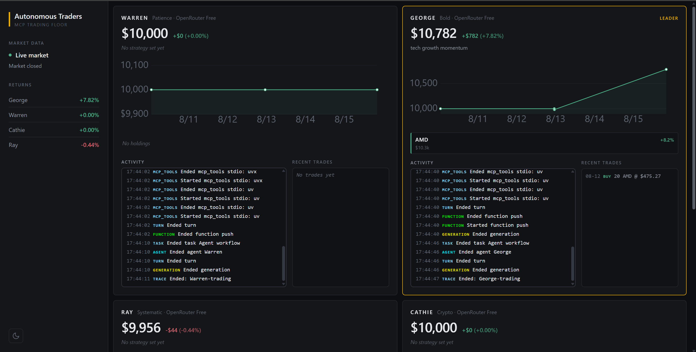

# 📈 AI Trader



**Four AI traders. Four strategies. One simulated market — and nobody watching over them.**

AI Trader is an autonomous trading floor. Four AI agents, each modelled on a famous investor,
manage their own $10,000 portfolio around the clock: researching the news, checking live market
prices, placing trades, reviewing their own performance, and rewriting their strategy when it
isn't working. You just watch the dashboard.

---

## 🧑‍💼 Meet the traders

| Trader        | Style      | What drives them                                      |
| ------------- | ---------- | ----------------------------------------------------- |
| 🧊 **Warren** | Value      | Patient, fundamentals-first, holds through the noise  |
| 🔥 **George** | Macro      | Contrarian, bets boldly against the crowd             |
| ⚖️ **Ray**    | Systematic | Diversified, risk-balanced, driven by economic cycles |
| 🚀 **Cathie** | Innovation | Chases disruption, trades crypto ETFs                 |

They run at the same time, on the same market, with the same tools — so the only thing separating
their results is how they think.

---

## ✨ Features

- 🤖 **Genuinely autonomous** — no prompts, no approvals. The traders decide what to research,
  what to buy, and when to sell, entirely on their own.
- 🔄 **A two-phase rhythm** — every trader alternates between hunting for **new opportunities**
  and **rebalancing** what it already owns, so it's never doing both badly at once.
- 🌍 **Real research, not guesswork** — each trader has its own research assistant that searches
  the live web, reads articles, and reports back before a single trade is placed.
- 📊 **Live market data** — real prices, fundamentals and technical indicators, with a built-in
  simulator so the whole thing still runs without a market data account.
- 🧠 **They remember** — every trader keeps a private, permanent knowledge base of the companies,
  sectors and sources it has looked into, and builds on it run after run.
- 📝 **They learn** — traders review how their past trades actually performed and rewrite their
  own strategy in response.
- 🖥️ **Two live dashboards** — portfolio value, holdings, trade history, and a real-time feed of
  what each agent is thinking and doing, right now.
- 🔔 **Push notifications** — a phone alert whenever a trader makes a move.
- 🛡️ **Built to keep running** — one trader hitting an error never stops the other three, and
  hitting an API limit shows up as a plain-English message, not a crash.

---

## 🔁 How a trading day works

```
   ┌──────────────────────────────────────────────────────┐
   │  Market opens                                        │
   │                                                      │
   │  ⏰  every few hours, all four traders wake up        │
   │      together and run at the same time                │
   │                                                      │
   │      1. 📰  research the news                         │
   │      2. 💹  check prices and portfolio                │
   │      3. 🧮  decide                                    │
   │      4. 💰  buy or sell                               │
   │      5. 🔔  send a notification                       │
   │                                                      │
   │  💤  then sleep until the next round                  │
   └──────────────────────────────────────────────────────┘
```

Each round is one of two kinds, and every trader alternates between them:

|                  | 🔍 **Trade phase**                        | ⚖️ **Rebalance phase**               |
| ---------------- | ----------------------------------------- | ------------------------------------ |
| The question     | _What should I buy that I don't own yet?_ | _Is what I already own still right?_ |
| Does research    | ✅ Yes — one full research pass           | ❌ No — market data is enough        |
| Updates strategy | Sometimes                                 | Often, based on real results         |

Splitting the day this way keeps each decision focused, and means the expensive part — live web
research — only happens when it actually changes the answer.

---

## 🛠️ Tech stack

| Layer          | Technology                                                            |
| -------------- | --------------------------------------------------------------------- |
| 🧠 Agents      | OpenAI Agents SDK                                                     |
| 🔌 Tools       | Model Context Protocol (MCP) over stdio                               |
| 💬 Models      | OpenRouter (free tier) · OpenAI · DeepSeek · xAI Grok · Google Gemini |
| 💹 Market data | Massive, with a built-in price simulator as fallback                  |
| 🌐 Research    | Tavily search · web page fetch · persistent knowledge graph           |
| 💾 Storage     | SQLite                                                                |
| 🖥️ Dashboards  | Gradio + Plotly, and FastAPI + Vite + TypeScript                      |
| 🔔 Alerts      | Pushover                                                              |
| 🐍 Runtime     | Python 3.12+, managed with `uv`                                       |

---

## 🔌 Tools the agents use

Every capability the traders have is a separate **MCP server** — a small standalone program the
agent talks to. Some are ours, some are off-the-shelf.

| Tool                   | Source                                                  | Gives the agent…                      |
| ---------------------- | ------------------------------------------------------- | ------------------------------------- |
| 💹 `mcp_massive`       | [Massive](https://github.com/massive-com/mcp_massive)   | Live prices, fundamentals, indicators |
| 🔎 `tavily-mcp`        | [Tavily](https://www.npmjs.com/package/tavily-mcp)      | Web search                            |
| 📄 `mcp-server-fetch`  | [Anthropic](https://pypi.org/project/mcp-server-fetch/) | Reading a web page                    |
| 🧠 `mcp-memory-libsql` | [npm](https://www.npmjs.com/package/mcp-memory-libsql)  | Permanent private memory              |
| 💰 `accounts_server`   | this project                                            | Balance, holdings, buying, selling    |
| 📈 `market_server`     | this project                                            | Simulated prices                      |
| 🔔 `push_server`       | this project                                            | Phone notifications                   |

---

## 🚀 Getting started

You'll need **Python 3.12+**, [**uv**](https://docs.astral.sh/uv/) and **Node.js**.

**1. Clone and install**

```bash
git clone <repo-url>
cd ai-trader
uv sync
```

**2. Add your keys**

```bash
cp .env.example .env
```

Only one key is genuinely required — `OPENROUTER_API_KEY`, which is free. Everything else is
optional and the app quietly falls back without it.

**3. Give the traders their starting money**

```bash
uv run -m backend.reset
```

Each trader gets $10,000 and their strategy. ⚠️ Running this again later wipes all balances,
holdings and history.

**4. Open the trading floor**

```bash
uv run -m backend.trading_floor
```

**5. Watch them work** — in a second terminal:

```bash
uv run app.py
```

Or run the standalone web dashboard instead:

```bash
uv run uvicorn backend.api:app --port 8000     # terminal 2
cd frontend && npm install && npm run dev      # terminal 3
```

> 💡 Always run commands from the project root.

---

## 🔑 Configuration

Your `.env` file:

```dotenv
# Required — free to get at openrouter.ai
OPENROUTER_API_KEY=

# Optional: give each trader a different frontier model
USE_MANY_MODELS=false
OPENAI_API_KEY=
DEEPSEEK_API_KEY=
GROK_API_KEY=
GOOGLE_API_KEY=

# Optional: live market data (otherwise prices are simulated)
MASSIVE_API_KEY=

# Optional: live web search for the research assistant
TAVILY_API_KEY=

# Optional: phone notifications
PUSHOVER_USER=
PUSHOVER_TOKEN=

# How often the traders wake up, and whether they trade outside market hours
RUN_EVERY_N_MINUTES=240
RUN_EVEN_WHEN_MARKET_IS_CLOSED=false
```

| Key                  | If you leave it blank                         |
| -------------------- | --------------------------------------------- |
| `OPENROUTER_API_KEY` | 🚫 Required — nothing runs without it         |
| `MASSIVE_API_KEY`    | Prices are simulated, market is always "open" |
| `TAVILY_API_KEY`     | Research falls back to reading pages directly |
| `PUSHOVER_*`         | No phone notifications                        |
| Other model keys     | Only needed with `USE_MANY_MODELS=true`       |

---

## 📚 Deep dives

- **[AGENT_CYCLE.md](AGENT_CYCLE.md)** — a single trader's run, step by step.
- **[BACKEND_ARCHITECTURE.md](BACKEND_ARCHITECTURE.md)** — how the system is put together.
- **[TRADEOFFS.md](TRADEOFFS.md)** — how the running cost was measured and cut in half.

---

## ⚠️ Note

This is a **simulated** portfolio. No broker is connected and no real money is ever at risk. A
small trading spread is applied to every order, so a brand-new position starts slightly down —
that's realistic, not a bug.

---

## 🙏 Acknowledgements

Built with the [OpenAI Agents SDK](https://openai.github.io/openai-agents-python/) and the
[Model Context Protocol](https://modelcontextprotocol.io/). Market data by
[Massive](https://massive.com), search by [Tavily](https://tavily.com), notifications by
[Pushover](https://pushover.net).
